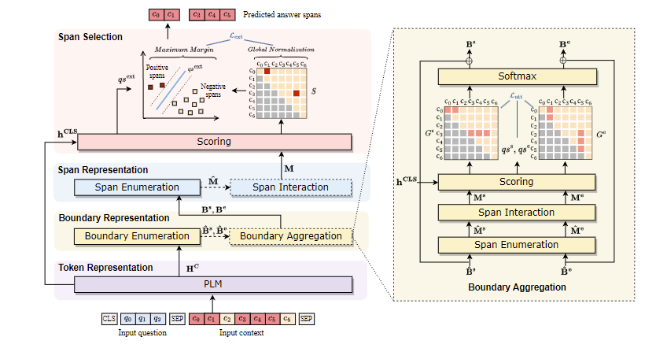

# The implementation of SpanQualifier on MindSpore 2.0

Code for "Spans, Not Tokens: A Span-Centric Model for Multi-Span Reading
Comprehension" (CIKM 2023)




## Installation
```angular2html
pip install -r requirements.txt
```

### The Usage of SpanQualifier
To train the SpanQualifier model, we can use the following command:
```angular2html
python run_SpanQualifier.py
```

