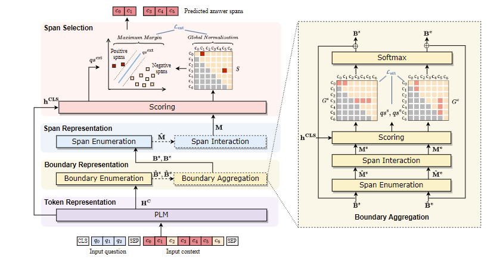

# SpanQualifier

This is a pytorch version of SpanQualifier, your can find the implementation based on MindSpore 2.0 in [here](https://github.com/nju-websoft/SpanQualifier/tree/main/MindSpore)

Code for "Spans, Not Tokens: A Span-Centric Model for Multi-Span Reading
Comprehension" (CIKM 2023)



## Installation
```angular2html
pip install -r requirements.txt
```

### The Usage of SpanQualifier
To train the SpanQualifier model, we can use the following command:
```angular2html
python run_SpanQualifier.py \
 --model_path $Pre_Train_Language_Model_PATH$ \
 --data_path_train $TRAIN_FILE_PATH$ \
 --data_path_dev $DEV_FILE_PATH$ \
 --data_path_test $TEST_FILE_PATH$ 
```

After training, the program will evaluate SpanQualifier and will report the scores of Exact Match F1 (EM) and Partial Match F1 (PM) on the dev and test sets.

The predictions on the dev and test sets will be saved in `/results/Dataset_Name/Model_Name/HyperParameters/dev.json` and  `/results/Dataset_Name/Model_Name/HyperParameters/test.json`, where the file structure is as follows:
```json
[
    {
        "The id of question": [
          "Answer span 1",
          "Answer span 2",
          ...
        ]
    },
    {
        ...
    }
]
```

The checkpoint of SpanQualifier will be saved in `/outputs/Dataset_Name/Model_Name/HyperParameters/pytorch_model.bin`.

